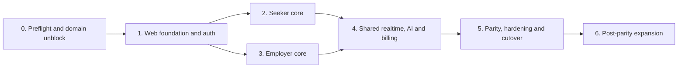

# TalentSouq web replica — implementation plan

**Status:** Ready for implementation after owner review  
**Specification:** [`README.md`](README.md)  
**Target:** `https://talentsouq.it.com`  
**Backend:** Existing hosted TalentSouq Supabase project

## 1. Delivery rules

- Build vertical slices that are usable and testable; do not generate every
  empty route before completing the first end-to-end flow.
- Keep released mobile clients compatible. Database and Edge Function changes
  must work for both web and the current store build.
- Treat RLS, Storage policies, and scoped RPCs as the authorization boundary.
  UI permission checks are for usability only.
- Start every feature from the corresponding mobile route, hook, shared rule,
  migration, and test. Record intentional web differences in the PR.
- Use Server Components for initial reads, Server Actions/Route Handlers for
  validated mutations where appropriate, and browser clients for Realtime,
  optimistic interaction, and direct policy-protected uploads.
- Complete English, Arabic/RTL, responsive, error, accessibility, and test work
  inside each slice rather than postponing them to a cleanup phase.
- No `SUPABASE_SERVICE_ROLE_KEY` in `apps/web`, public environment variables, or
  browser bundles.
- Use Node.js 22+ locally and in CI/deployment.

## 2. Workstream and dependency map



Seeker and employer implementation may proceed in parallel after Phase 1, but
both must use the same web primitives and data-access conventions.

## 3. Phase 0 — preflight and domain unblock

**Outcome:** The existing public requirements are live over HTTPS, and the team
has proven the hosted backend is safe to share before customer-web feature work.

### P0.1 Preserve the current domain unblock path

- Redeploy the current `apps/admin` commit so `/privacy`, `/terms`,
  `/careers/[slug]`, `/jobs/[id]`, and both `.well-known` files exist.
- Replace the Android app-signing SHA-256 placeholder in `assetlinks.json`.
- Temporarily attach `talentsouq.it.com` to that deployment if the web foundation
  is not ready in time for store review.
- Verify HTTPS, status `200`, and no redirects for the two `.well-known` files.

**Acceptance:** Public legal and link-association URLs pass the curl/health checks
already documented in `NEXT_STEPS.md`, and mobile store review is no longer
blocked by the domain.

### P0.2 Hosted backend readiness audit

- Compare local and hosted migration lists; apply the repository migrations that
  are not present in hosted only after review.
- Run database advisors and review RLS, function grants, views, and Storage
  policies used by customer clients.
- Execute integration tests against hosted/UAT for seeker, employer owner,
  recruiter, hiring manager, viewer, and unrelated-user access.
- Confirm required buckets, Realtime publications, and all deployed Edge
  Functions in the admin health report.
- Confirm final credit allowances/pricing are either signed off or remain clearly
  gated from production purchase.

**Acceptance:** Hosted schema parity and role-isolation evidence are recorded;
no customer web launch proceeds on an unverified local-only schema.

### P0.3 Baseline inventory and fixtures

- Create stable UAT users for seeker, employer owner/admin/recruiter/hiring
  manager/viewer, suspended user, and admin.
- Seed at least one record for each important state: active/draft/closed job,
  all application/ATS stages, invitation, interview, assessment, message thread,
  notification, saved job/search, folder, media item, credits, and subscription.
- Capture current mobile reference screenshots at compact width in English and
  Arabic for the primary routes.

**Acceptance:** A deterministic dataset supports parity comparisons and E2E
tests without depending on production user data.

## 4. Phase 1 — web foundation, public routes, and auth

**Outcome:** `apps/web` is deployable, uses the existing Supabase project, and a
new or existing user can complete authentication and role onboarding in both
languages.

### P1.1 Scaffold `apps/web`

- Add the workspace package using the same pinned Next.js/React generation as
  `apps/admin`; follow its installed versioned docs rather than generic examples.
- Add package scripts for `dev`, `build`, `start`, `lint`, `typecheck`, `test`,
  and `e2e` and wire them into root workflows.
- Add `.env.example` with public Supabase URL/publishable key and optional web
  error-monitoring configuration. Document production and preview variables.
- Configure TypeScript aliases, ESLint, Tailwind/CSS pipeline, Playwright, unit
  test runner, and CI caching.
- Create separate public, auth, seeker, and employer route groups.

**Acceptance:** Clean install, typecheck, lint, unit-test command, production
build, and a Playwright smoke test pass in CI.

### P1.2 Port the web design system

- Convert mobile semantic colors, spacing, radius, type metrics, state colors,
  and role tints into typed CSS variables/tokens.
- Load Inter and IBM Plex Sans Arabic without layout shift.
- Implement theme and language preferences with server-readable cookies and
  correct initial `<html lang dir>` output.
- Build and document the initial accessible primitives: Button, Link, Input,
  Textarea, Select/Combobox, Checkbox, Radio, Card, Badge/Status, Alert,
  Dialog/Drawer, Tabs, Skeleton, Empty/Error states, Avatar, File Upload, and
  Pagination/Table.
- Build the responsive public header and authenticated app shells.

**Acceptance:** Component tests cover keyboard/focus/error behavior; automated
contrast checks pass for light/dark and seeker/employer themes; no first-paint
theme or direction flash.

### P1.3 Supabase browser/server foundation

- Add separate browser, server, and Proxy client utilities using
  `@supabase/ssr` and the publishable key.
- Refresh tokens in `proxy.ts`; validate identity in protected layouts/actions
  with verified claims or a fresh user lookup.
- Add reusable guards for signed-in state, `profiles.role`, onboarding status,
  suspended status, and organization permissions.
- Add a repository check that rejects service-role imports/variables in
  `apps/web`.
- Document caching: public anonymous queries may cache deliberately;
  authenticated/user-specific responses are private and never shared.

**Acceptance:** Anonymous, seeker, employer, wrong-role, suspended, and expired
session route tests produce the intended response without leaking protected
content.

### P1.4 Browser authentication

- Implement role choice, email sign-up, verification by code/link, sign-in,
  sign-out, forgotten password, password update, Google OAuth, and Apple OAuth.
- Preserve the existing `set_initial_social_signup_role` behavior for first-time
  social sign-up and prevent role mutation after account creation.
- Configure exact localhost, preview, and production redirect allow-list entries
  in Supabase. Preserve all mobile scheme redirects.
- Implement `/auth/callback` PKCE code exchange and safe `next` validation that
  accepts only same-origin relative destinations.
- Implement account deletion and session cleanup.
- Test mobile verification/reset links after changing hosted Auth settings.

**Acceptance:** Every auth flow works on web and remains working in the current
mobile builds; open-redirect tests fail safely; cookies use production-safe
attributes.

### P1.5 Public foundation and domain handoff

- Build the landing page, public job index/detail, career page, invite landing,
  privacy, terms, sitemap, robots, metadata, Open Graph images/data, and custom
  404/error pages.
- Copy the final `.well-known` association files into the web deployment with
  exact JSON content types and no redirects.
- Ensure public job/career queries expose only fields intended for anonymous
  users and rely on explicit RLS/grants.
- Create the new Vercel project rooted at `apps/web`; configure preview and
  production environments and health checks.
- Move `talentsouq.it.com` from the temporary admin deployment to `apps/web`
  only after all public URL checks pass on the Vercel preview/production URL.

**Acceptance:** The apex domain serves valid HTTPS; public pages are indexable
as intended; auth routes work; app links, legal links, and career links continue
to work before and after cutover.

## 5. Phase 2 — seeker replica

**Outcome:** A seeker can complete the core employment journey on web and see
the same results on mobile.

Implement in the following vertical slices. Each slice includes initial server
data, mutations, mobile cross-check, responsive UI, English/Arabic, accessibility,
unit/integration coverage, and a Playwright happy path.

### P2.1 Seeker onboarding and profile

- Profile setup and completeness.
- About, personal/details, experience, education, skills/certifications, links,
  job-search attributes, avatar upload/replace/delete, CV upload/view/download,
  and account/profile settings.
- Browser file constraints and signed CV access; never expose permanent private
  CV URLs.
- Public profile preview and profile visibility behavior.

**Acceptance:** Create/update/delete operations appear correctly in mobile;
invalid files and unauthorized CV requests are rejected.

### P2.2 Job discovery

- Seeker dashboard and recommendations.
- Job feed with search, category, employment type, location, salary, posted date,
  experience, multi-select filters, sorting, badges, and pagination.
- Job detail, similar jobs, share/copy link, bookmark, saved jobs, saved searches,
  and alerts.
- Preserve public `/jobs/[id]` as the canonical detail URL; progressively add
  authenticated actions rather than duplicating a private job page.

**Acceptance:** Filter/query results match the shared rules and representative
mobile queries; URL query parameters preserve shareable filter state.

### P2.3 Applications and invitations

- Easy Apply with validation, confirmation, idempotency, existing-application
  handling, and optional CV state.
- External Apply link/handoff and recorded external application state.
- Application timeline/status, detail, withdrawal, and status feedback.
- Employer invitations: list, detail, accept/view/apply, and decline.

**Acceptance:** A submitted/withdrawn application and invitation action is
immediately correct in both clients; double submit cannot create duplicates.

### P2.4 TalentAi seeker tools

- Match intent onboarding/editing, run match, digest/results, ranking display,
  match explanation, and profile completeness nudge.
- CV draft and bio rewrite through the existing `ai-profile-assist` function.
- Preserve draft-only AI behavior and show credit/availability errors without
  losing entered content.

**Acceptance:** Edge Functions receive the signed-in user's JWT, results match
the same stored intent/digest visible on mobile, and failures are recoverable.

## 6. Phase 3 — employer replica

**Outcome:** An employer organization can run the complete hiring workflow on
web under the same permission model as mobile.

### P3.1 Company and organization foundation

- Company setup/profile: about, details, contact, logo/avatar, and public fields.
- Current organization resolution and role/permission-aware navigation.
- Members list, invitations, invite acceptance, role changes, removal, last-owner
  protection messaging, and assigned-job behavior for hiring managers.

**Acceptance:** Owner/admin/recruiter/hiring manager/viewer matrix matches
`role_permissions` and RLS; forbidden actions remain forbidden when invoked
directly rather than through the UI.

### P3.2 Vacancy management

- Dashboard metrics and links.
- Jobs list by status; create, validate, preview, publish/draft, edit, duplicate,
  close, and reopen where supported.
- Plan/feature gates and job limits using shared rules.

**Acceptance:** Job lifecycle state and limit behavior match mobile and the
database; a seeker can discover a newly active job on both platforms.

### P3.3 Applicant inbox and ATS

- Cross-job applicants and per-job applicant lists with filtering and sorting.
- Applicant detail, public profile, signed CV, application timeline, private
  notes, status transitions, contact/message actions, and AI draft cards.
- Desktop ATS board plus semantic list/table alternative. Pointer drag may be an
  enhancement, but all stage changes must work by keyboard and explicit menu.
- Respect hiring-manager job assignments in every query.

**Acceptance:** All application transitions use shared transition rules; role
isolation and assigned-job narrowing pass hosted integration tests.

### P3.4 Candidate discovery and invitations

- Candidate directory, search attributes, filters, activity ranking, result
  summaries, saved searches, CV folders, and folder membership.
- Invite a candidate to an active job with existing/deduplicated state handling.
- Follow/public profile behavior shared with seeker social routes.

**Acceptance:** Candidate visibility and private-field boundaries match RLS;
saved searches/folders are organization-scoped and mobile-compatible.

### P3.5 Interview, assessment, and branding centers

- Interview scheduling with provider-agnostic meeting URL, upcoming/today/7-day
  lists, candidate notification, and feedback form.
- Assessment templates, handoff URLs/token replacement, send flow, and results
  state; do not invent a provider webhook before a vendor is chosen.
- Career-page settings, employee stories, corporate video links, and company
  media upload/management.

**Acceptance:** Scheduled interviews/assessments and branding content render in
both clients and on the public career page with correct permissions.

### P3.6 Employer TalentAi, credits, and premium gates

- Employer matching/intent and run-match experience.
- Job description, candidate summary, interview questions, and offer-letter AI
  drafts via `ai-recruiter-assist`.
- Credit balances/gauges, server-side consumption results, insufficient-credit
  states, and premium module locked/upsell presentation.
- Do not add a candidate-ranking generator to `ai-recruiter-assist`; current
  ranking belongs to `ai-run-match` unless separately designed.

**Acceptance:** AI charges and authorization remain server-side, failed/forbidden
requests do not generate output, and balances agree across web/mobile.

## 7. Phase 4 — shared collaboration, notifications, and billing

**Outcome:** Cross-role, realtime, and external-service flows reach full parity.

### P4.1 Feed and profiles

- Shared chronological feed, news stripe, composer, post image/layout, premium
  highlight gate, my posts, deletion if supported, public user profiles, follows,
  and follower/following lists.
- Use responsive optimized images and preserve Storage ownership rules.

### P4.2 Messaging

- Inbox, unread badges, get-or-create thread flows, direct/profile/post message
  entry points, message history pagination, send/retry, timestamps, and realtime
  subscriptions.
- Cleanly unsubscribe/reconnect channels and deduplicate optimistic/realtime rows.
- Document the current limitation that unread state is per-device SecureStore on
  mobile; either keep web unread state local for parity or implement a separately
  designed server-side unread model for all clients.

### P4.3 Notifications

- Notification centre, realtime badge/list updates, read state/actions, route
  mapping, and notification preferences.
- Web V1 does not register Expo tokens. Add browser Web Push only as a later
  cross-platform notification project.

### P4.4 Billing

- Current subscription/plan state, checkout start, customer portal, success,
  cancel, and refreshed entitlement state.
- Update the existing Edge Functions to choose only allow-listed web or mobile
  return destinations; do not trust arbitrary origins supplied by the client.
- Complete Stripe test-mode E2E and webhook idempotency checks before live mode.

**Acceptance for Phase 4:** Two browsers plus one mobile device can exchange
messages and observe notifications; checkout/portal returns to the initiating
platform and the shared subscription row updates through the webhook.

## 8. Phase 5 — parity, hardening, and production cutover

**Outcome:** The web replica meets the specification's finish line and is safe
for public launch.

### P5.1 Automated verification

Run from the repository root and keep all existing mobile/admin/shared checks
green:

```bash
pnpm install --frozen-lockfile
pnpm -r typecheck
pnpm -r lint
pnpm -r test
pnpm --filter @talentsouq/web build
pnpm --filter @talentsouq/web e2e
pnpm --filter @talentsouq/db-tests test:integration
```

Add CI gates for:

- Bundle/build warnings and accidental service-role references.
- Route accessibility smoke tests and critical axe checks.
- English/Arabic visual snapshots at compact, tablet, and desktop widths.
- Public metadata, robots, sitemap, cache headers, and `.well-known` headers.
- Auth redirect safety, RLS isolation, Storage access, Realtime, and Stripe
  webhook/return behavior.

### P5.2 Manual cross-platform UAT

Run each flow on web and verify the result in a store/dev mobile build:

1. Sign up by email as seeker; verify; onboard; sign out/in; reset password.
2. Google and Apple sign-in for a new role and an existing account.
3. Create full seeker profile; upload/view/replace CV and avatar.
4. Search/filter/save a job; save a search; apply; withdraw; submit feedback.
5. Receive and act on an employer invitation.
6. Create/update employer profile and organization; invite members; exercise all
   five organization roles and a hiring-manager assignment.
7. Create draft job; publish/edit/duplicate/close; view it publicly and as seeker.
8. Apply as seeker; review as employer; add note; move through every ATS stage.
9. Schedule interview; submit feedback; send assessment; verify notification.
10. Search candidate; save search; add to folder; invite to job.
11. Create post with image; follow user; start direct and post-based messages.
12. Exchange realtime messages and notifications between browser and mobile.
13. Configure TalentAi; run seeker/employer matching and each AI draft action.
14. Start Stripe checkout; receive webhook entitlement; open portal; return to
    the initiating platform.
15. Switch English/Arabic, light/dark, compact/desktop, keyboard-only, and a
    representative screen reader through the critical journeys.
16. Suspend a UAT user and confirm both clients block access; delete another UAT
    account and confirm session/data cleanup.

### P5.3 Security and privacy review

- Threat-model auth callbacks, Server Actions, file uploads, public job/career
  projections, message subscriptions, organization role changes, AI functions,
  checkout returns, and caching.
- Confirm CSP, HSTS, frame protection, referrer, permissions, and content-type
  headers appropriate to Vercel/Supabase usage.
- Confirm no PII, tokens, CV text, or message content is logged to analytics,
  client errors, or public caches.
- Reconcile rendered privacy/terms pages with the reviewed canonical legal text.
- Run Supabase database/security advisors and resolve launch-blocking findings.

### P5.4 Performance and launch

- Measure Lighthouse/Core Web Vitals on landing, jobs, job detail, career page,
  seeker dashboard, employer jobs, and applicant detail.
- Fix measured image, font, JavaScript, hydration, caching, and query waterfalls.
- Configure production monitoring, uptime checks, alerts, rollback owner, and a
  documented Vercel rollback procedure.
- Cut over DNS/domain only after preview sign-off; repeat HTTPS, auth, legal,
  public content, and `.well-known` checks on the apex domain.
- Observe error rate, auth failures, Edge Function failures, Realtime connections,
  and Stripe webhooks closely after release.

**Exit criteria:** All success criteria in the specification pass, no P0/P1
security or data-integrity defect remains, and every in-scope route has an owner-
accepted web result or an explicit signed-off exception.

## 9. Suggested pull-request sequence

Keep reviews bounded and deployable in roughly this order:

1. `web: scaffold app, CI, environments, and smoke test`
2. `web: port tokens, i18n/RTL, primitives, and shells`
3. `web: add Supabase SSR clients, proxy, guards, and auth callbacks`
4. `web: ship public routes, legal pages, metadata, and app-link files`
5. `web: ship seeker onboarding/profile and Storage flows`
6. `web: ship job discovery, saved state, applications, and invitations`
7. `web: ship employer organization/company and vacancy management`
8. `web: ship applicants, ATS, candidate search, and invitations`
9. `web: ship interviews, assessments, branding, AI, credits, and billing`
10. `web: ship feed, profiles/follows, messaging, and notifications`
11. `web: complete parity automation, accessibility, security, and performance`
12. `web: production domain cutover and launch runbook`

Do not combine schema changes, a new web surface, and unrelated mobile redesigns
in one pull request.

## 10. Post-parity backlog

These are compatible with the architecture but must not delay the replica:

- Installable PWA and standards-based Web Push with a shared server-side unread
  model across web and mobile.
- SEO landing pages by GCC country, city, category, and company with deliberate
  canonical/noindex rules.
- Employer desktop analytics, exports, bulk applicant actions, richer ATS board,
  and collaborative notes/mentions.
- Passkeys/MFA and organization SSO after an auth/security design.
- Calendar and meeting-provider integrations.
- Selected assessment-provider webhooks.
- Executive Search, Emiratization Hub, Salary Benchmarking, and a signed-off tier
  above Pro.
- Cursor pagination and search indexing when measured dataset growth requires it.
- Shared notification/read-state service, browser notification preferences, and
  cross-device activity state.
- Consent-aware product analytics, experimentation, referral, and conversion
  funnels after privacy requirements are approved.

## 11. Owner review checklist before implementation starts

- [ ] Approve a separate `apps/web` application and separate admin deployment.
- [ ] Approve `talentsouq.it.com` for public plus signed-in customer web routes.
- [ ] Confirm the temporary admin-domain deployment may be used to unblock store
      review before the web app is ready.
- [ ] Confirm replica scope and that Web Push/PWA is post-parity.
- [ ] Confirm target browser support.
- [ ] Confirm public job indexing and private candidate/profile indexing policy.
- [ ] Confirm the final legal entity, governing law, address, and approved legal
      copy before public launch.
- [ ] Sign off employer plans, prices, credit allowances, and AI credit costs
      before enabling production purchases.

